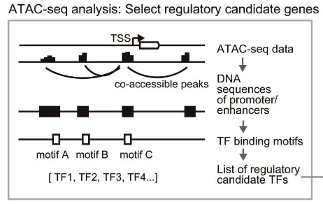
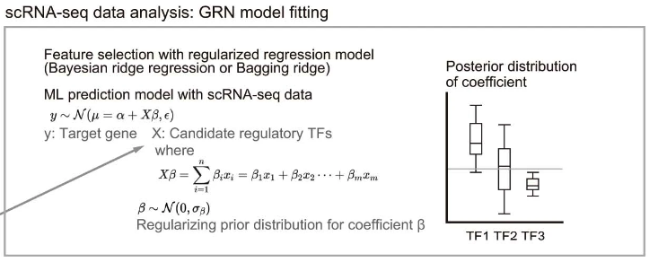

author: Adam Klie <br>
email: aklie@ucsd.edu <br>
date: 2024-05-02

# TODO
- [ ] Test on a diverse set of datasets
- [ ] Add to IGVF docs

# CellOracle GRN inference

# Quick start
1. Modify the config in `config/config.yaml` or create a new one with the same structure
- [ ] Point to the correct input file (`input_loc`) (see [Expected input](#expected-input))
- [ ] Change output directory (`outdir`) to where you want the output to be saved. This will include all intermediate files and the final MuData object (see [Output](#output))
- [ ] Modify the scratch directory (`scratchdir`) to where you want the temporary genome files to be saved
- [ ] If you are planning to use the singularity image with the `--use-singularity` flag, modify the path to the CellOracle singularity container (`singularity_image`)
- [ ] Choose the number of threads to use (`threads`) based on your system
- [ ] Change the `genome` to the correct species and version (e.g. `hg38`)
- [ ] Modify other parameters as needed (see below for more details)

2. Run the pipeline
```bash
snakemake --cores 1 outdir/celloracle.h5mu --configfile /path/to/config.yaml
snakemake --use-singularity --cores 1 outdir/celloracle.h5mu --configfile /path/to/config.yaml  # Use singularity container
```

# Expected input
* `mdata.h5mu` — MuData object in h5mu format containing single-cell multiome data. (see [MuData documentation](https://mudata.readthedocs.io/en/latest/))
    * The MuData object MUST contain the following:
        * `atac` in `mod` -- h5ad for scATAC-seq data
            * `layers["counts"]` — a sparse matrix of raw fragment counts
            * `var_names` — a list of region names in 'chr-start-end' format
        * `rna` in `mod` -- h5ad for scRNA-seq data
            * `layers["counts"]` — a sparse matrix of raw UMI counts
        * `obs` — a dataframe of cell metadata
            * `"cell_identity"` — a column of cell type annotations (specify `cluster_key` to match in the config file)
        * `var` — a dataframe of gene metadata

> 🚨 **Important Note:**
>
> The 'counts' layer matrix MUST be a scipy sparse matrix. Use of a dense matrix will currently cause an error.
>

# Workflow
The CellOracle method consists of the following steps:
- ***scRNA-seq data preparation***: run kNN imputation on the scRNA-seq data
- ***base GRN construction***: build a set of possible TF to gene links using co-accessible distal and TSS peaks
- ***GRN model construction***: use a Bayesian Ridge regression to refine the base GRN with scRNA-seq data
- ***In silico gene perturbation***: simulate perturbations of TFs using the GRN model to predict gene expression changes

> **Note**
> IMPORTANT: Here we are just taking advantage of CellOracle's GRN inference method (steps 2 and 3 above). We first assume you have already analyzed your scRNA-seq data to the point where you have interesting clusters you would like to build GRNs for. In the evaluation part of this pipeline, we take in arbitrary GRNs (i.e. they can be inferred using any method) and evaluate them using the CellOracle in silico perurbation method.

# Pipeline outputs
* `r2g.csv` — region to gene links
```bash
cre,gene,score,pval
chr1-107964928-107965436,VAV3,1.0,
chr1-167627734-167628592,RCSD1,0.175306413124479,
chr1-167630023-167630677,RCSD1,1.0,
chr1-224160037-224160917,WDR26,0.211109775653612,
chr1-224433432-224434024,WDR26,1.0,
```
> **Note**
> The `score` column is the co-accessibility score between the region and gene. The `pval` column is NaN for CellOracle as Cicero does not provide p-values. A score of 1.0 indicates that this is a TSS peak, anything less than 1.0 is a distal peak.

* `tf2r.csv` — TF to region links
```bash
cre,tf,score,pval
chr1-107964928-107965436,SP4,306.97722557821425,
chr1-107964928-107965436,E2F2,39.214405253215055,
chr1-107964928-107965436,KLF6,33.173333506316666,
chr1-107964928-107965436,TCF7L2,21.085326175707472,
chr1-107964928-107965436,SP1,20.0,
```
> **Note**
> The `score` column is the motif score for the TF binding to the region. The `pval` column is NaN for CellOracle as GimmmeMotifs does not provide p-values. Rigth now, I believe we are allowing for both direct and indirect TF binding to the region. We may want to keep track of this in the future.

* `grn.csv` — TF to gene links
```bash
tf,gene,score,pval,cluster
ARID5B,FAM13A,0.3710782,1.2700890408360003e-05,HSC
ARID5B,SAMD9,0.13423152,0.024985336730666132,Proerythroblast
ARID5B,FAM13A,0.11488605,0.04676196383997795,Proerythroblast
ARID5B,DST,0.006444159,0.860277418467874,MK/E prog
ARID5B,SAMD9,-0.02657091,0.6167909876627851,HSC
```
> **Note**
> The `score` column is the coefficient of the TF in the Bayesian Ridge regression. The `pval` column is the p-value of the coefficient across the bagging. The `cluster` column is the cell type cluster that the GRN was built in.

## Building a base GRN


Start with scATAC-seq data.

1. Use Cicero to generate region to gene links
2. Annotate TSSs:
    - By default, CellOracle uses HOMER’s TSS database and finds all peaks that overlap TSS’s
    - It will then look for any peaks with a co-accessibility score greater than a threshold to these TSS peaks and call this a putative region-gene link
3. Perform a TF binding motif scan:
    - By default, CellOracles uses a `gimmemotifs` database and the `gimmemotifs` `scan` function.
    - **Note:** Does not allow multiple TF binding sites to occur in a single input region

> **Note**
> Cicero region to gene connections are called globally! Not at cell type resolution. It is possible we add cell type specific region to gene links in the future.

## Refining the GRN with scRNA-seq data


Briefly, each gene’s expression will be predicted by candidate regulators defined in a base GRN. A bagging ridge regression is fit to each gene and coefficient distributions (for each candidate regulator TF) are calculated from each bagging run. The mean of this distribution is output for each TF-gene is returned along with a p-value corresponding to a 1-sample t-test for the distribution of coefficients with the alternative hypothesis that the coefficient is different from 0. The number of bagging samples to use as well as the regularization strength can be tuned.

# More details

## Parameter recommendations
Coming soon

## Environment
You can find a `.def` file for building the singularity container in the `envs/` directory:
```bash
singularity build --remote envs/celloracle.sif workflow/envs/celloracle.def 
```
