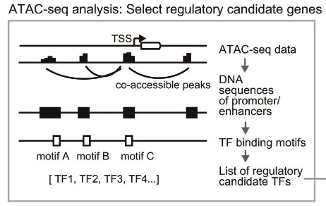
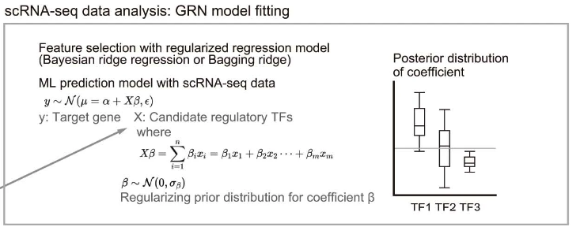

author: Adam Klie <br>
email: aklie@ucsd.edu <br>
date: 2024-02-28

# TODO
- [x] Full test on neurips.small.h5mu
- [ ] Complete expected output section of this README
- [ ] Need to sort out the expectation of the counts tables present (CellOracle needs both log1p and raw counts)
- [ ] Need to sort out the expectation of the embedding
- [ ] Need to think about the best output format for the GRN
- [ ] Develop logic for when no scATAC seq data is present
- [ ] Add to IGVF docs

# CellOracle GRN inference

# Quick start
1. Modify the config in `config/config.yaml` or create a new one with the same structure
- [ ] Point to the correct input file (`input_loc`) (see [Expected input](#expected-input))
- [ ] Change the `organism` to the correct species (currently only human and mouse are supported)
- [ ] Change output directory (`outdir`) to where you want the output to be saved. This includes all intermediate files and the final MuData object (see [Output](#output))
- [ ] Modify the path to the CellOracle singularity container (`singularity_image`) (see [Environment](#environment) for more details)
- [ ] Modify the scratch directory (`scratch`) to where you want the temporary files to be saved
- [ ] Choose the number of threads to use (`threads`) based on your system
- [ ] Modify other parameters as needed

2. Run the pipeline
```bash
snakemake --cores 1 outdir/celloracle.h5mu --configfile /path/to/config.yaml
snakemake --use-singularity --cores 1 outdir/celloracle.h5mu --configfile /path/to/config.yaml # Use singularity container
```

# Expected input
* `mdata.h5mu` — MuData object in h5mu format containing single-cell multiome data. (see [MuData documentation](https://mudata.readthedocs.io/en/latest/))
    * The MuData object MUST contain the following:
        * `atac` in `mod` -- h5ad for scATAC-seq data
            * `layers["counts"]` — a sparse matrix of raw fragment counts
            * `var_names` — a list of region names in 'chr-start-end' format
        * `rna` in `mod` -- h5ad for scRNA-seq data
            * `layers["counts"]` — a sparse matrix of raw UMI counts
        * `obs` — a dataframe of cell metadata
            * `"celltypes"` — a column of cell type annotations
        * `var` — a dataframe of gene metadata

# Expected output

# Scripts
See below for more details on each step of the CellOracle pipeline.



## `peak_corr.R` - use Cicero to identify co-accessible peaks
```bash
Rscript workflow/scripts/peak_corr.R {input.data} {params.organism} {output.path_all_peaks} {output.path_connections}
```
- Runs Cicero on the scATAC-seq data to identify co-accessible peaks. 
- The output is a list of all peaks (`all_peaks.csv`) and all pairwise peaks with coaccessibility scores (`cicero_connections.csv`)

## `tss_annotation.py` — identify peaks that overlap TSS and use this for initial peak-to-gene linking
```bash
python workflow/scripts/tss_annotation.py -a {input.all_peaks} -c {input.connections} -o {params.organism} -t {params.thr_coaccess} -p {output}
```
- Identify peaks that overlap TSSs as annotated from the HOMER database
- Thresholds the co-accessibility score to only include high-confidence connections

## `tf_motif_scan.py` — scan peaks for motifs and use this for initial TF-to-peak linking
```bash
python workflow/scripts/tf_motif_scan.py -p {input} -o {params.organism} -f {params.fpr} -t {output}
```
- Scans peaks for motifs using `gimmemotifs scan` (TODO: add refs)
- Currently defaults to gimme.vertebrate.v5.0 for human, but we could add support for other databases

## `build_base_grn.py` — incorporate these peak-to-gene and TF-to-peak links into an initial TF-gene GRN
```bash
python workflow/scripts/build_grn.py -m {input.mdata} -b {input.base_grn} -l {output}
```
- Incorporates the peak-to-gene and TF-to-peak links into an initial TF-gene GRN
- Generates an adjacency matrix of TF-gene links where the columns are the TFs and the rows are the genes (with the TSS peak also included)

## `build_grn.py` — Run the regularized linear regression for identifying bona fide TF-gene links

```bash
python workflow/scripts/build_grn.py -m {input.mdata} -b {input.base_grn} -l {output}
```
- 
- Run sklearn's regularized linear regression to identify bona fide TF-gene links

## `filter_grn.py` — Prune low confidence calls using p-value threshold
```bash
python workflow/scripts/filter_grn.py -l {input.grn} -b {input.base} -p {params.thr_edge_pval} -t {params.thr_top_edges} -g {output.grn} -r {output.base}
```
- Prune low confidence calls using p-value threshold
