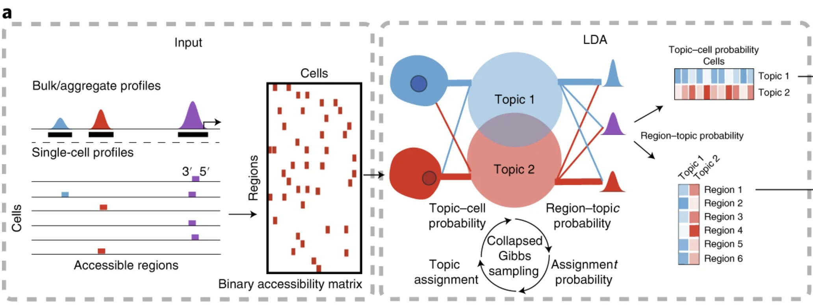
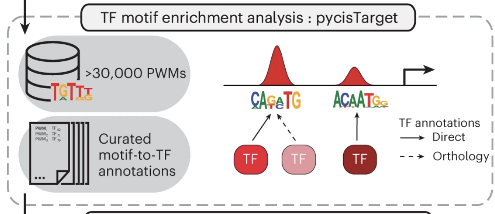
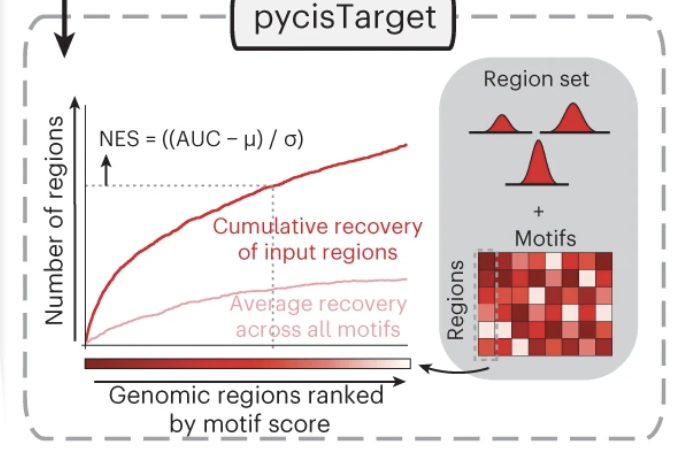
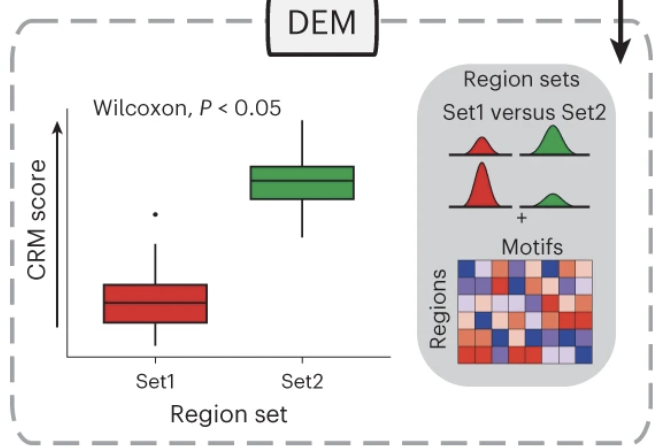
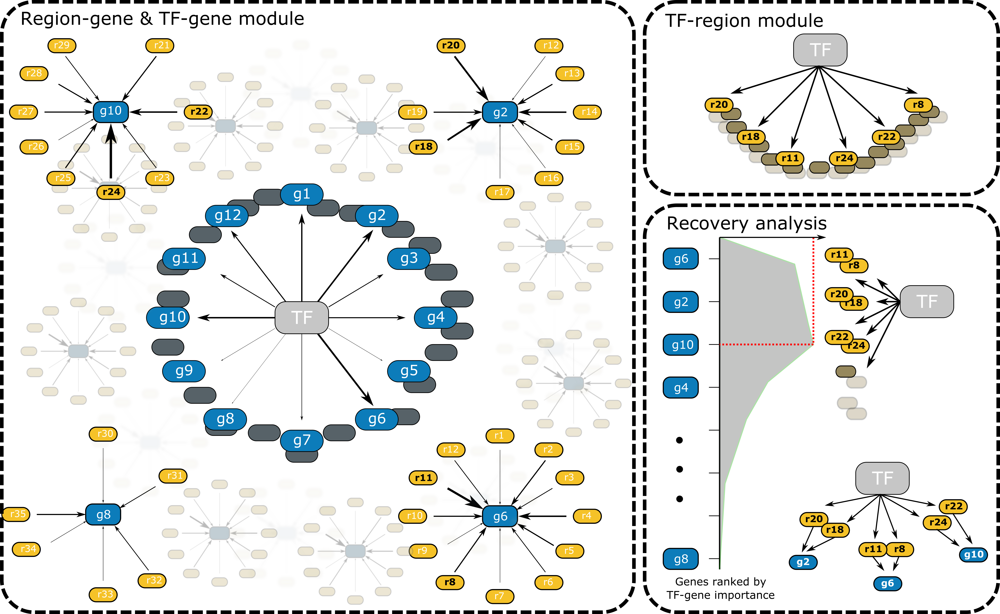

author: Adam Klie <br>
email: aklie@ucsd.edu <br>
date: 2024-02-21

# TODO
- [x] Document how each SCENIC+ script works here
- [x] Push this README and neurips.small.h5mu to the repo
- [x] Figure out best way to host motif annotations, rankings and scores for the `run_cisTarget.py` script (https://resources.aertslab.org/cistarget/)
- [x] How to handle configurable parameters for the snakemake rule. Abandon gin for this? Somehow integrate the two? --> SCENIC+ has same directory structure (will be included in main pipeline eventually)
- [x] Look a little closer at the outputs of SCENIC+ to make sure that endpoints make sense
- [x] Update scripts to store outputs in mudata
- [x] Get running neurips.small.h5mu    
- [ ] Update this README with clear instructions on how to run the pipeline and what the expected outputs are and mean
- [ ] Make a human ready config and a mouse ready config
- [ ] Fix singularity container problems and rebuild
- [ ] Test on SCENIC+ singularity container
- [ ] Find place to host the singularity container
- [ ] Figure out how to run pipeline end-to-end without having to pass in any file names (e.g. `snakemake --cores 1 --configfile /path/to/config.yaml` instead of `snakemake --cores 1 --configfile /path/to/config.yaml tri.csv`)
- [x] Should we allow modififiable search space
- [x] Add conda environment

# SCENIC+ GRN inference
This directory contains a snakemake workflow for running the SCENIC+ pipeline for inference of gene regulatory networks (GRNs) from single-cell multiome data (paired scRNA-seq and scATAC-seq).

# Quick start
1. Modify the config in `config/config.yaml` or create a new one with the same structure
- [] Point to the correct input file (`input_loc`) (see [Expected input](#expected-input))
- [] Change the `organism` to the correct species (currently only human and mouse are supported)
- [] Change output directory (`outdir`) to where you want the output to be saved. This includes all intermediate files and the final MuData object (see [Output](#output))
- [] Modify the path to the SCENIC+ singularity container (`singularity_image`) (see [Environment](#environment) for more details)
- [] Modify the scratch directory (`scratch`) to where you want the temporary files to be saved
- [] Choose the number of threads to use (`threads`) based on your system
2. Run the pipeline
```bash
snakemake --cores 1 --configfile /path/to/config.yaml tri.csv  # need to figure out how to not have to pass in tri.csv
snakemake --use-singularity --cores 1 tri.csv  # Use singularity container
```

# Expected input
* `mdata.h5mu` — MuData object in h5mu format containing single-cell multiome data. (see [mudata documentation](https://mudata.readthedocs.io/en/latest/))
    * The MuData object MUST contain the following:
        * `atac` in `mod` -- h5ad for scATAC-seq data
            * `layers["counts"]` — a sparse matrix of raw fragment counts
            * `var_names` — a list of region names in 'chr-start-end' format
        * `rna` in `mod` -- h5ad for scRNA-seq data
            * `layers["counts"]` — a sparse matrix of raw UMI counts
        * `obs` — a dataframe of cell metadata
            * `"celltypes"` — a column of cell type annotations
        * `var` — a dataframe of gene metadata

# Expected output
* Once the pipeline completes successfully, the `outdir` specified in the config will contain a variety of [SCENIC+ outputs](https://scenicplus.readthedocs.io/en/latest/pbmc_multiome_tutorial.html#Note-on-the-output-of-SCENIC+)
* Inference results are stored in the h5mu format in `scenic+.h5mu`
    * uns["cistromes] -- a dictionary of cistromes where significant TF motifs are keys and the values are the regions that are enriched for that motif (see [run_cisTarget.py](#runcistargetpy) for more details)
    * uns["r2g"] -- a dataframe of region-to-gene edges with weights inferred via GBM regression of region accessibility onto gene expression (see [run_scenic+.py](#runscenicpy) for more details)
    * uns["grn"] -- a dataframe of gene regulatory network (GRN) adjacencies with weights inferred via GBM regression of TF expression onto gene expression (see [run_scenic+.py](#runscenicpy) for more details)
    * uns["tri"] -- a dataframe containing GRN adjacencies pruned via SCENIC+ using cistromes and r2g links (see [run_scenic+.py](#runscenicpy) for more details)
    * uns["tri_filtered"] -- the same as uns["tri"] but with edges that are likely false removed (see [filter_links.py](#filterlinkspy) for more details)

# Scripts
See below for more details on each step of the SCENIC+ pipeline.

## `run_cisTopic.py` — build topic models from the scATAC-seq matrix
```bash
python run_cisTopic.py -i /path/to/input/mdata.h5mu -o human -c cistopic_obj.pkl -n '2;4;8;16' -t 150 -a 50 -x True -e 0.1 -y False -m models.pkl
```

SCENIC+ uses cisTopic to infer topics from single-cell ATAC-seq data based on Latent Dirichlet Allocation (LDA).
- Builds a cisTopic object from the input MuData
    - Binarizes the matrix
    - Removes regions overlapping with an input blacklist
    - Currently requires matrix is converted to a dataframe, **will be a memory issue with large matrices**
    
- Runs Latent Dirichlet Allocation (LDA) on the binarized scATAC-seq matrix
    - Uses collapsed Gibbs sampling (cgs) from **`lda`** Python package for its LDA implementation (https://lda.readthedocs.io/en/latest/#)
        - **Parallelizable but this can lead to memory issues**
    ```python
    import lda
    model = lda.LDA(
                n_topics=n_topics,
                n_iter=n_iter,
                random_state=random_state,
                alpha=alpha,
                eta=eta,
                refresh=n_iter,
            )
    model.fit(binary_matrix)
    ```
    - `-n` -- Number of topics, will build a model for each number of topics
    - `-t` -- Number of iterations for which the Gibbs sampler will be run
    - `-a` -- Scalar value indicating the symmetric Dirichlet hyperparameter for topic proportions
    - `-x` -- Whether to divide alpha by the number of topics
    - `-e` -- Scalar value indicating the symmetric Dirichlet hyperparameter for topic multinomials
    - `-y` -- Whether to divide eta by the number of topics
    - `-m` -- All model objects are saved as a pickle file
 - Best number of topics is chosen by combination of average model coherence, log-likelihood, a divergence-based metric from Arun et al. (2010) and a density-based metric from Cao Juan et al. (2009)
 - The region-topic matrix and cell-topic matrix are saved in the cistopic object as a pickle file
 - **If you have a lot of cells, cgs will be very slow adn we may need to move to mallet implementation**
For more details: https://www.notion.so/adamklie/cisTopic-98eed1e6b4bd4b20b80660a68e1f5229 (email for access)

## `candidate_enhancers.py` — identify a set of regions for motif enrichment, including binarized topics and differentially accessible regions
```bash
python candidate_enhancers.py -c cistopic_obj.pkl -o otsu_bin_topics.pkl -n 3000 -t top_bin_topics.pkl -s 1000000 -r 10000 -m markers.pkl
```
SCENIC+ uses the cisTopic object to identify regions for motif enrichment in three ways:
1. Calls regions for each topic using the Otsu method (**reference needed**)
2. Calls regions for each topic using the top N regions based on region-topic probabilities
3. Calls regions using differentially accessible regions
    - Multiplies the cell-topic matrix by the region-topic (transposed) matrix to get a cell-region matrix that is a smoothed version of the original matrix (`s` is a scale factor to multiply the imputed cell-topic matrix)
    - Normalizes the imputed cell-topic matrix with scale factor (`r`) -- cell-level normalization 
    - Finds highly variable regions using a ScanPy-like method
    - Finds differentially accessible regions (DARs) in the imputed, normalized cell-topic matrix from the highly variable regions using a Wilcoxon rank-sum test
- Saves all of these as "region sets" in dictionary as a pickle file (keys are 'topics_otsu', 'topics_top', 'DARs')
- Imputed and normalized cell-topic matrix is saved in the cisTopic object as a pickle file
For more details: https://www.notion.so/adamklie/cisTopic-98eed1e6b4bd4b20b80660a68e1f5229 (email for access)

## `run_cisTarget.py` — build cistromes through running both pycisTarget and a differentially enriched motif (DEM) algorithm
```bash
python run_cisTarget.py -o human -p {input.path_otsu_bin_topics} -t top_bin_topics.pkl -m markers.pkl -d menr.pkl
```

SCENIC+ uses two strategies to infer TF motif enrichment to build cistromes (a TF and all it's putative enhancers). They require several databases of external information. These databases are hosted at `https://resources.aertslab.org/cistarget/` and are downloaded based on the paths in the config file.
    - A pre-built database of TF motifs and their annotations (https://pycistarget.readthedocs.io/en/latest/motif_table.html): We use the SCENIC+ motif collection that includes more than 34,524 unique motifs gathered from 29 motif collections `motifs-v10nr_clust-nr.hgnc-m0.001-o0.0.tbl`
    - Requires a pre-built database of **scores** of genomic loci for each TF motif (https://pycistarget.readthedocs.io/en/latest/tools.html#generation-of-cistarget-databases): We typically use the scores computed at ENCODE SCREEN loci.
    - A pre-built database of **rankings** of genomic loci for each TF motif (https://pycistarget.readthedocs.io/en/latest/tools.html#generation-of-cistarget-databases): We typically use the rankings computed at ENCODE SCREEN loci.
1. cisTarget
    
    - Uses a recovery curve approach to determine what TFs are enriched in each region set (https://pycistarget.readthedocs.io/en/latest/tools.html#cistarget)
2. Differentailly enriched motif (DEM) algorithm
    
    - Uses a Wilcoxon test between scores in foreground and background region sets to assess motif enrichment (https://pycistarget.readthedocs.io/en/latest/tools.html#dem)

 - By default, this is done with and without promoters included in the analysis
 - The results are saved as a pickle file that contains the cistromes for each region set (all runs)
For more information, see https://www.notion.so/adamklie/cisTarget-5a3807f44cfe4d8a81cca4d8a5670ec5 (email for access)

## `run_scenic+.py` — calculate e2g links and grn adjacencies through gradient boosted models and apply several post-hoc analyses to the edges to determine which are true and which are likely false
```bash
python run_scenic+.py -i mdata.h5mu -c scenic+/cistopic_obj.pkl -m scenic+/menr.pkl -o human -s scenic+ -g scenic+/grn.csv -r scenic+/r2g.csv -t scenic+/tri.csv
```
SCENIC+ uses gradient boosted machines (GBMs) to calculate edges from regions to genes (e2g links) and TFs to genes (a classic GRN) as follows:
1. Calculates TF-gene links using GBM regression by predicting raw gene expression from TF gene expression counts
    - Each gene gets its own model
    - After the model is fit, the importance score of each feature (TF) is calculated and considered a putative TF-gene link
    - Infers the direction of regulation (activating/repressing) using linear correlation (only >0.03 or <-0.03 are kept)
    - Importance score of a TF for itself is set to the maximum importance score across all genes added with an arbitrary small value of 1 × 10−5.
2. Calculates e2g links using GBM regression by predicting raw gene expression from imputed region accessibility
    - Each gene gets its own model
    - Defines a search space around gene's transcription start site (TSS) and considers only regions in this space for the model
    - After the model is fit, the importance score of each feature (region) is calculated and considered as a putative e2g link
    - Binarized by taking the 85th, 90th and 95th quantile of the region-to-gene importance scores, the top 5, 10 and 15 regions per gene and a custom BASC implementation (**reference needed**)
3. Builds an eRegulon (a TF with its set of target regions and genes) for each TF by combining the cistromes, e2g links, and TF-gene links using GSEA ranking and recovery
    
    - First uses 2 different ways to build TF-gene links
    - (i) Grab the TF's cistrome and find all the genes linked to this TF via the e2g links calculated in (2)
    - (ii) Just use the TF-gene links calculated in (1)
    - Perform gene set enrichment analysis (GSEA) using
        - A ranked version of (ii) as the ranked list
        - The genes in (i) as the gene set
    - Genes from the leading edge are retained and are the target genes of the eRegulon
    - This analysis is run separately for TF–gene and region–gene relationships with positive and negative correlation coefficients
    - eRegulons with fewer than ten predicted target genes or obtained from region–gene relationships with a negative correlation coefficient were discarded.
4. Post-hoc filtering
    - Each eRegulon can be derived from motifs which are annotated directly to the TF (for example the annotation comes from a ChIP-seq experiment in a cell line of the same species) or the annotation can be extended (the annotation is infered based on orthology or motif similarity. Only keeping eRegulons with an extended annotation if there is no direct annotation available
    - Discarding eRegulons for which the region-to-gene correlation is negative

# Output

# Environment

## From a sigularity definition file
```bash
# Create the initial image
singularity build --remote envs/scenic+.sif workflow/envs/scenic+.def

# Create a sandbox image that I could edit
singularity build --sandbox envs/scenic+ envs/scenic+.sif

# Current def has a problem with libstdc++.so.6 that I need to fix, this is a bandaid fix for now
strings ~/opt/miniconda3/lib/libstdc++.so.6 | grep GLIBCXX_3.4.29 # confirm its there
cp ~/opt/miniconda3/lib/libstdc++.so.6 envs/scenic+/lib/x86_64-linux-gnu

# Modify files in the code based on the following issues
## https://github.com/aertslab/scenicplus/issues/76 --> fix in:https://github.com/aertslab/scenicplus/commit/821ee7b719afbd1d1e74aadb3ffda9e27165c930
## https://github.com/aertslab/scenicplus/issues/21 --> fix in: https://github.com/aertslab/scenicplus/commit/03e41ee4256c358a07ca32c64704dcff5b821b03

# Rebuild the image
singularity build envs/scenic+.sif envs/scenic+
```

## From a conda environment
COMING SOON
1. Potential error in trying to make a cisTopic object (`run_cisTopic.py`)
    - https://github.com/aertslab/pycisTopic/issues/40
    - Easy fix is to just turn it into a dataframe, but this could be an issue with large matrices and low mem
2. I had to make two modifications directly to the code (grep `# ADAM` to find)
    - https://github.com/aertslab/scenicplus/issues/76
        - https://github.com/aertslab/scenicplus/commit/821ee7b719afbd1d1e74aadb3ffda9e27165c930
    - https://github.com/aertslab/scenicplus/issues/21
        - https://github.com/aertslab/scenicplus/commit/03e41ee4256c358a07ca32c64704dcff5b821b03
    - Did it this way because I wasn’t sure what commit would actually work, future obviously I need a stable commit
3. Starting a ray session is not working on this env, forces me to use [scenicplus](https://www.notion.so/scenicplus-268767bb39ff4450a46b24a2328bd3e2?pvs=21) environment for the topic inference step, but this environment does not have snakemake

# Issues
- When running on `CharacterizationMcGinnis_Dataset6.2D`, we hit ray spill errors where it appears the tmp directory specified in the container is full
- When running on `CharacterizationMcGinnis_Dataset6.2D`, I hit the following error —> https://github.com/aertslab/scenicplus/issues/203
    - Current fix is just to ignore it and move on
- https://github.com/aertslab/pycistarget/issues/6 — issue when number of foreground and background regions for cisTarget are the same number
- https://github.com/aertslab/pycistarget/issues/16 — happens in cisTarget object creation (seems like I need to remove mito fragments)